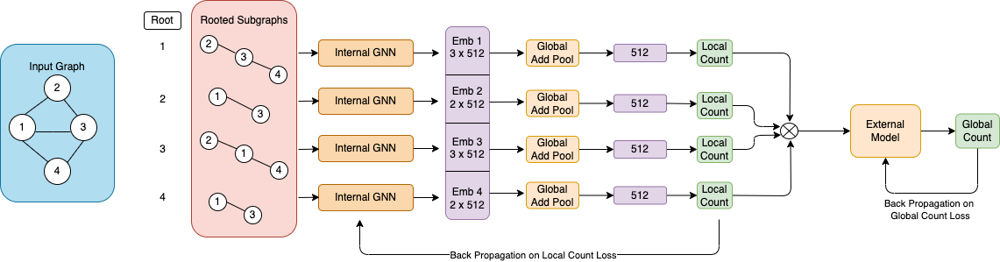
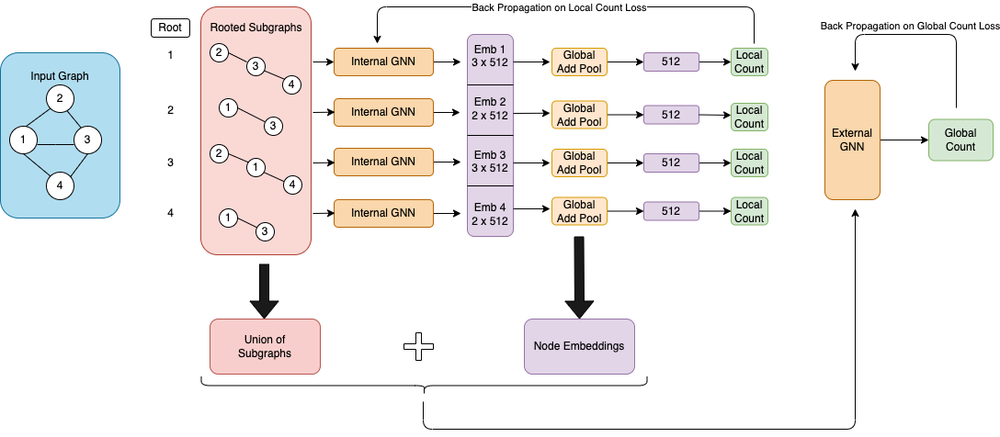

# InSig-GNN



# InsideOut-GNN



The model can be trained using the following command:

```shell
python main.py \
--task triangle/3star \
--dataset dataset_1/dataset_2 \
--batch_size 1 \
--lr 0.0001 \
--epochs 100 \
--step 500
```


To run fragmentation using the previous model:
```shell
python fragmentation_main.py \
--task K4/chordal \
--dataset dataset_1/dataset_2 \
--batch_size 1 \
--lr 0.0001 \
--epochs 100 \
--step 500 \
--output_file chordal_frag
```
